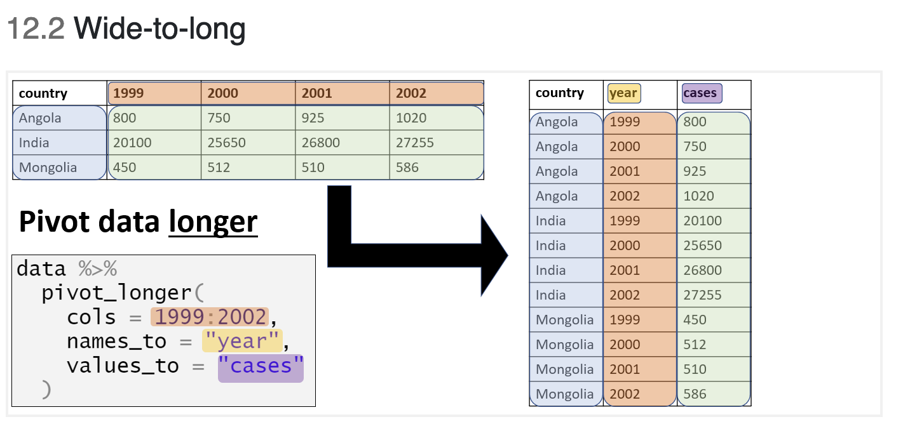

```{r setup, include=FALSE}
knitr::opts_chunk$set(echo = TRUE)
library(here)
```

## Introduction

-   Course structure
-   Why R?
-   Installing R
-   Setting up files/folders
-   R packages
-   Importing data
-   Useful resources

## Course structure

Presentations built around content developed for the [Epidemiologist R handbook](https://epirhandbook.com/)

-   An excellent resource for all skill/experience levels

-   Direct towards specific sections for you to work through in your own time

-   2 hours sessions, twice a week to present key topics and answer questions

Capstone project

\- To apply R skills to data you regularly use

\- Present on the challenges and enablers

## Why R?

[](https://data-flair.training/blogs/why-learn-r/)

## Installing R

For this course, you will need to install 2 items:

1.  R programming language

2.  R Studio

    -   Integrated Development Environment (IDE)

    -   A very helpful resource for writing and running R code

    You will need to install them in this order - First R, then R studio

[Guide to installing R](https://www.earthdatascience.org/courses/earth-analytics/document-your-science/setup-r-rstudio/)

## Setting up files and folders

{width="300"}

## Setting up files and folders - Best practice

Setting up files and folders will make your analysis (and life!) easier

-   Folder structure

-   Naming files and folders

## Setting up files and folders - Folder structure

R Studio works best when you use its project function

-   Each project contains all of your inputs, outputs and code

-   This also makes it easier to share folders with colleagues

    -   Everything is in one place!

Projects are covered in more detail in [Chapter 6 "R Projects"](https://epirhandbook.com/r-projects.html)

## Setting up files and folders - Naming files and folders

If you want to share your code with colleagues or when you return to code after several weeks/months you will be grateful that you gave your files and folders meaningful names!

Many organisations have style guides to ensure that teams can collaborate on coding projects

-   [Tidyverse style guide](https://style.tidyverse.org/files.html#names)

[{width="800"}](https://style.tidyverse.org/files.html#names)

-   Key points to remember for naming

    -   Keep the name short

        -   Instead of "*data_import_of_file_for_analysis.R*"

            -   "*import_file.R*"

    -   Avoid spaces!

        -   Instead of "*import file.R*"

            -   "\_" "*import_file.R*"
            -   "-" "*import-file.R*"
            -   camelCase "*importFile.R*"

## R packages

What is an R package?

*An R package is a collection of functions which you can use to import, clean, analyse and report your data*

Link to Epidemiologist R handbook - 3.7 "[Packages](https://epirhandbook.com/r-basics.html#packages)"

Packages can simplify your workflow by combining multiple steps into a smaller number of commands

Example: [readxl](https://readxl.tidyverse.org/) is a package of functions used to import data from Excel to R.

## R packages - Installing a package

install.packages("readxl")

We have asked R to install the package "readxl".

The installation has been successful. The installation only has to take place once. You do not need to re install the packages every time you start a new project as they are saved in your library.

-   In R, red text does not mean there has been an error!

    You will now be able to see the package in your list of packages

    {width="250"}

## R packages - Loading a package

Now that readxl has been installed, you will be able to load it and use its functions

```{r}
library(readxl)
```

{width="250"}

When the package has been successfully loaded, you will see a tick mark in the box.

## R packages - Using a package

Each package has multiple functions that you can use on your data.

To read more about a particular package type

```{r}
?readxl
```

{width="250"}

For this example, we want to import data that is currently stored in an Excel formatted file ".xlsx"

So we can use the function *read_xlsx f*rom the readxl package

```{r}
read_xlsx(here('data','AfricaCovid','AfricaCovid.xlsx'))
```

But what does this show? And how can we use it?

-   Before importing a file from Excel, it may be helpful to open it in Excel so we can see what data are stored in the file

{width="250"}

So when we tell R to use the function read_xlsx, it reads the first sheet which is called "ReadMore".

It looks like this is a summary sheet with information about when data for each country was last updated.

So how do we tell R to read in a different sheet from the Excel file?

## R packages - Using a package 4

Question - How many confirmed cases of COVID were recorded across Africa in July 2020?

First step - Import data from the sheet containing information on COVID cases

We can use the excel_sheets function from readxl to get the names of all sheets in the Excel workbook

```{r}
excel_sheets(here('data','AfricaCovid','AfricaCovid.xlsx'))
```

From this list we can see that we want to import data from the sheet "Infected_per_day".

```{r}
read_xlsx(here('data','AfricaCovid','AfricaCovid.xlsx'), sheet="Infected_per_day")
```

We can see a snapshot of the data from the sheet "Infected_per_day"

## Objects - In R, everything is an object

So far we have installed, loaded and used a package (`readxl`)

But how do we use the information generated from these actions?

We assign the information to "objects"

[Section in Epidemiologist for R handbook about Objects](https://epirhandbook.com/r-basics.html#objects)

*"Everything you store in R - datasets, variables, a list of village names, a total population number, even outputs such as graphs - are **objects** which are **assigned a name** and **can be referenced** in later commands."*

## Objects - Example

To explain objects, we will calculate a value, assign it to an object and then use the object for a second calculation.

```{r}
2+2
```

We can assign the calculation "2+2" to an object called "a"

```{r}
a <- 2+2
```

We can then use the object a to show the results of the calculation

```{r}
a
```

We can also use this value for further calculations such as adding 4 to the object a

```{r}
a + 4
b <- a+4

```

The result of this calculation is now stored in the object "b"

```{r}
b
```

## Objects: Assigning our data to an object

In the previous section, we used the function read_xlsx from the package readxl to import data from an Excel spreadsheet.

But we didn't assign this to an object, so it is not possible to use the data from the import step.

We can assign the data to an object and then conduct further analysis.

```{r}
africa_covid_cases <- read_xlsx(here('data','AfricaCovid','AfricaCovid.xlsx'), sheet="Infected_per_day")
```

You will now see the object in the "Environment" section of R Studio.

{width="250"}

Now the data have been assigned to the object "`africa_covid_cases`", we can start to work with the data.

## Working with data

In the `africa_covid_cases` object, there are 53 obs (observations) of 492 variables.

So what does this mean?

We can look at our data to get more information

```{r}
africa_covid_cases
```

ISO - 3 letter code assigned to each country

COUNTRY_NAME - Name of the country

AFRICAN_REGION - African region

43831, 43832, 43833 - This looks like a date format used by Excel. It is the number of days since January 1, 1970.

## Working with data - other ways to look at data

Show the first 5 rows

```{r}
head(africa_covid_cases, n=5)
```

Show the last 7 rows

```{r}
tail(africa_covid_cases, n=7)
```

How many unique countries are in the data?

```{r}
unique(africa_covid_cases$COUNTRY_NAME)
```

There are 53 unique country values. This is helpful as there are also 53 rows so we can say that each row represents a country.

We can assign the list of unique countries to an object for future reference

```{r}
country_list <- unique(africa_covid_cases$COUNTRY_NAME)
```

## Working with data - looking at one variable

In the previous step, the following command was used

unique(africa_covid_cases\$COUNTRY_NAME)

What does "\$" do in R?

It allows us to look at a specific variable within the dataset

```{r}
unique(africa_covid_cases$AFRICAN_REGION)
```

And again we can assign this to an object

```{r}
region_list <- unique(africa_covid_cases$AFRICAN_REGION)
```

## The tidyverse

When using R, there are many approaches you can use to reach the same result.

There are thousands of packages with many functions and sometimes these packages can overlap.

This can be confusing when you are starting to learn R.

There is a collection of packages with many of the most commonly used packages and this is called the [`tidyverse`](https://www.tidyverse.org/).

```{r}
tidyverse::tidyverse_packages()
```

We will use functions from some of these packages over the next few sessions.

## The tidyverse: Tidy data

The key concept when working with packages from the tidyverse is the concept of "tidy data".

[R for Epidemiologist handbook 4.1 From Excel - Tidy data](https://epirhandbook.com/transition-to-r.html?q=tidy#tidy-data)

Principles of "[tidy data](https://r4ds.had.co.nz/tidy-data.html)":

1.  Each variable must have its own column
2.  Each observation must have its own row
3.  Each value must have its own cell

## The tidyverse: Why is this important?

Functions from the tidyverse packages are set up to work with tidy data.

If your data are not tidy, then you will have to restructure the data to a tidy format.

Restructuring can take a lot of time if the data are stored in Excel spreadsheets with a lot of formatting/merged columns.

[{width="250"}](https://www.openscapes.org/blog/2020/10/12/tidy-data/)

## The tidyverse: Checking if data are tidy

In a previous step, we imported COVID case data from an Excel spreadsheet.\
But how do we know if the data are "tidy"

Remember there are 3 principles

1.  Each variable must have its own column
2.  Each observation must have its own row
3.  Each value must have its own cell

```{r}
head(africa_covid_cases, n=3)
```

So are the data "tidy"?

The data from the spreadsheet are not "tidy".

The columns "43831, 43832, 43833..." represent different dates. Therefore, this does meet the second argument of "tidy data" - "Each observation must have its own row".

But we can fix this using functions from the packages included in the tidyverse

Remember, first we must install the packages from the tidyverse

`install.packages("tidyverse")`

## The tidyverse: Tidying data 

Now that the tidyverse has been installed, we can use the functions from the packages to "tidy" the data.

One package which is very helpful for this is called "`tidyr`"

Instead of loading individual packages, we can load the core tidyverse packages with one command

```{r}
library(tidyverse)
```

The core packages contain powerful functions we can use to process, analyse and visualise data.

Remember to look at the documentation for a package type "?[name of package]"

Example -

`?tidyr`

To look at the functions within a package, type [name of package]::

Example

`tidyr::`

To reformat the data to a tidy format, we need to transform the data from wide to long.

The Epidemiologist R handbook has an excellent section describing how to do this

12 - [Pivoting data](https://epirhandbook.com/pivoting-data.html?q=pivot_long#pivoting-data)

## The tidyverse: Wide to long

## [{width="600"}](https://epirhandbook.com/pivoting-data.html?q=pivot_long#wide-to-long)

```{r wide_to_long}
africa_covid_cases_long <- africa_covid_cases %>% 
  pivot_longer(cols=4:492, names_to="excel_date", values_to="cases")

```

Transforming data from wide to long usually requires a few attempts to ensure you have the correct outcome!

```{r}
head(africa_covid_cases_long, n=3)
```

This looks correct!

You can add comments to code to show other people (and remind yourself!) why you wrote the code in a particular way

```{r wide_to_long_example, eval=FALSE, echo=TRUE}
africa_covid_cases_long <-
  africa_covid_cases %>% #tell R to use this dataset
  pivot_longer(cols = 4:492,#select the columns you want
               names_to = "excel_date", #name the new date column
               values_to = "cases") #name the new cases column

```

## Working with dates

[](https://iso.mit.edu/americanisms/date-format-in-the-united-states/)

To add to the confusion, Excel has 2 additional date systems:

1.  1900 date system

2.  1904 date system

    {width="780"}

In the data set we are using, the dates are in this format:

```{r}
head(africa_covid_cases_long$excel_date)
```

We can use a function from another package to convert this to a standard date format.

```{r, eval=FALSE, echo=T}
install.packages("janitor")
```

```{r}
library(janitor)
```

The package [`janitor`](https://cran.r-project.org/web/packages/janitor/vignettes/janitor.html) has many helpful functions for cleaning data

```{r}
africa_covid_cases_long <- africa_covid_cases_long %>% 
  mutate(date_format=excel_numeric_to_date(as.numeric(excel_date)))

head(africa_covid_cases_long$date_format)
```

The new variable created "date_format" is in the format YEAR-MONTH-DATE.

We can also check if the values in the new variable look correct

```{r}
min(africa_covid_cases_long$date_format) #minimum date
max(africa_covid_cases_long$date_format) #maximum date
```

We know this is a data set of COVID cases so the date range (from the start of 2020 through to May of 2021) looks to be correct.

## Your analysis dataset 

We have created 2 data objects - *`africa_covid_cases` and `africa_covid_cases_long`*

Before analysing the data, it is a good idea to generate a new dataset which only contains the variables you need to analyse.

So what variables do we have in *`africa_covid_cases_long`*

```{r}
names(africa_covid_cases_long)
```

We can select the variables we want to keep using the select function from the dplyr package

`dplyr` is a core part of the tidyverse so it is loaded when you write `library(tidyverse)`

```{r}
analysis_dataset <- africa_covid_cases_long %>% 
  select(date_format,AFRICAN_REGION, COUNTRY_NAME, cases)
```

We can look at the first few rows of the dataset we have created to check we have selected the desired variables.

```{r}
head(analysis_dataset)
```

The `select` function from the `dplyr` package is very useful.

It can also be used to rename selected variables

```{r}
analysis_dataset <- africa_covid_cases_long %>% 
  select(date=date_format,region=AFRICAN_REGION, country=COUNTRY_NAME, cases)
```

We have renamed `AFRICAN_REGION` and `COUNTRY_NAME` as `region` and `country`

```{r}
head(analysis_dataset)
```

## Answering questions with data 1

So far we have:

-   Imported the data from an Excel worksheet

-   Reshaped the data into a "tidy" format

-   Changed the format of a variable to a date

-   Selected only the variables we want to use for the analysis

Now we can start to use the dataset to answer questions

*How many confirmed cases of COVID-19 have been recorded in Africa?*

```{r}
analysis_dataset %>% 
    summarise(total_covid_cases=sum(cases))

```

The answer is "NA", which stands for "Not Available"

This is a good example of how R deals with missing data

-   There may be dates in our dataset where there were no confirmed cases of COVID-19 recorded

-   When data are missing, R will display "NA" for the variable

-   If you try to run a calculation on data where there is one or more "NA" values, the results will be "NA"

There are several options for dealing with missing values in R

1.  Complete case analysis

    -   Remove rows with any missing data

```{r}
full_dataset <- na.omit(analysis_dataset)
```

2.  Exclude "NA" values from calculations

    -   Add an additional argument to the function to remove "NA"

```{r}
analysis_dataset %>% 
    summarise(total_covid_cases=sum(cases, na.rm=TRUE))
```

This command has now excluded NA values and has provided us with an answer for the number of confirmed COVID-19 cases in Africa - 4,561,465

*How many confirmed cases of COVID-19 have been recorded in Africa, by region?*

```{r}
analysis_dataset %>% 
  group_by(region) %>% 
    summarise(total_covid_cases=sum(cases, na.rm=TRUE))
```

`group_by` is a very powerful function for summarising data

```{r}
analysis_dataset %>% 
  group_by(region) %>% 
    summarise(total_covid_cases=sum(cases, na.rm=TRUE)) %>% 
  arrange(-total_covid_cases)
```

The `arrange` function can be used to organise the results. In this case we have instructed R to sort the results by the `total_covid_cases` variable, from highest to lowest value.

We can add multiple variables to `group_by`

If we add region and country to the group_by command, sort from highest to lowest, we can see which countries reported the most confirmed COVID-19 cases

```{r}
analysis_dataset %>% 
  group_by(region, country) %>% 
    summarise(total_covid_cases=sum(cases, na.rm=TRUE)) %>% 
  arrange(-total_covid_cases)
```

Another useful function is `filter` which can be used to apply filters to calculations

We can repeat the previous calculation, but then add a filter to only include results from countries in Northern Africa

```{r}
analysis_dataset %>% 
  group_by(region, country) %>% 
    summarise(total_covid_cases=sum(cases, na.rm=TRUE)) %>% 
  arrange(-total_covid_cases) %>% 
  filter(region=="Northern Africa")
```

The filter can be applied at any point within the calculation. For very complex calculations, it is helpful to apply the filter as early as possible. This reduces the number of records before the complex portion of the calculation occurs.

`filter` can also be used to make data frames

```{r}
northern_africa <- analysis_dataset %>% 
  filter(region=="Northern Africa")
```

Using filters, we can answer additional questions.

*When was the first confirmed case of COVID-19 in Northern Africa?*

```{r}
northern_africa %>% 
  filter(cases>0) %>% 
  filter(date == min(date, na.rm=TRUE)) 
```

Here we have added 2 filters:

1.  Only keep records where the value for `cases` is higher than 0

2.  Only keep records where the value for `date` is equal to the minimum value for `date.` We have also added the `na.rm=TRUE` command from a previous step. If you don't know the data very well, it is good practice to add this command.

When was the first confirmed case of COVID-19 in Northern Africa, by country?

```{r}
northern_africa %>% 
  group_by(country) %>% 
  filter(cases>0) %>% 
  filter(date == min(date, na.rm=TRUE)) 
```

These results can be stored in an object for future use

```{r}
first_cases_northern_africa <- northern_africa %>% 
  group_by(country) %>% 
  filter(cases>0) %>% 
  filter(date == min(date, na.rm=TRUE)) 
```

On what date, was the 100th case of COVID-19 reported from each country in Northern Africa?

```{r}
northern_africa %>% 
  group_by(country) %>% 
  mutate(cumulative_cases=cumsum(cases)) %>% 
  filter(cumulative_cases>=100) %>% 
  slice(1) %>% 
  pull(date, country)
```

Here we have introduced two new functions `slice` and `pull`

`slice` can be used to select certain rows from a dataset. In this case, we have added a column which is the cumulative number of cases, selected the first row after filtering the dataset to only include results where the value is greater than or equal to 100, and then selected the first row using the slice command.

An additional step is the `pull` command. This is useful when you want to extract specific values from the result.

```{r}
first_100cases <- northern_africa %>% 
  group_by(country) %>% 
  mutate(cumulative_cases=cumsum(cases)) %>% 
  filter(cumulative_cases>=100) %>% 
  slice(1) %>% 
  pull(date, country)
```

## Visualising data

One of the key strengths of R is visualising data. There are many packages which have functions you can use to make graphs, tables, maps...the list is endless!

The first package of functions we will use for visualising data is another core `tidyverse` package called `ggplot2.` This is commonly referred to as `ggplot`

We have already loaded the package when we ran `library(tidyverse)`

You can also choose to only load the ggplot2 package by typing `library(ggplot2)`

```{r}
library(ggplot2)
```

The Epidemiologist R handbook has 2 sections focused on `ggplot`

1.  [ggplot basics](https://epirhandbook.com/ggplot-basics.html)

2.  [ggplot tips](https://epirhandbook.com/ggplot-tips.html)

These sections contain very helpful explanations of many of the functions available with ggplot. There are also a number of excellent references for every type of graph you want to make.

We will walk through some common examples to teach some of the most common approaches

Make a graph of confirmed COVID-19 cases in Northern Africa

```{r}
ggplot(northern_africa, aes(x=date,y=cases)) +
  geom_line()
```

This command has generated a line graph of confirmed COVID-19 cases for countries in Northern Africa.

From earlier steps, we know that the dataset `northern_africa` contains data from multiple countries: \`r unique(northern_africa\$country'

We can add more information to the ggplot command to draw separate lines for each country

```{r}
ggplot(northern_africa, aes(x=date,y=cases, color=country)) +
  geom_line()
```

To make the graph more presentable, we can add more options to the ggplot command

```{r}
ggplot(northern_africa, aes(x=date,y=cases, color=country)) +
  geom_line() +
  labs(x='Date', y='Total cases', color='Country') + #label axes
  theme(legend.position='top') + #place legend at top of graph
  scale_x_date(date_breaks = '2 months', #set x axis to have 2 month breaks
               date_minor_breaks = '1 month', #set x axis to have 1 month breaks
               date_labels = '%d-%m-%y') #change label for x axis

```

It is still difficult to see the data for each country. There is a helpful command to fix this

```{r}
ggplot(northern_africa, aes(x=date,y=cases, color=country)) +
  geom_line() +
  labs(x='Date', y='Total cases', color='Country') + #label axes
  theme(legend.position='none') + #remove legend by setting position to 'none'
  scale_x_date(date_breaks = '2 months', #set x axis to have 2 month breaks
               date_minor_breaks = '1 month', #set x axis to have 1 month breaks
               date_labels = '%d-%m-%y') + #change label for x axis
  facet_wrap(~country) # this will create a separate graph for each country
```
